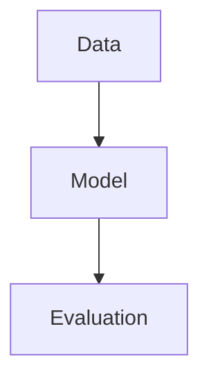

# Hoang The Jason — Academic Blog Platform

A production-oriented Astro static site for academic blogging, research notes, paper summaries, course notes, dataset notes, and notebook rendering.

## Stack

- Astro static output
- TailwindCSS
- Markdown + MDX
- Decap CMS
- Pagefind
- KaTeX
- Shiki
- Mermaid
- Giscus
- Jupyter notebook static rendering
- Plausible Analytics
- GitHub Pages deployment

## Local development

```bash
npm install
npm run dev
```

The notebook build script runs automatically before `dev` and `build`.

## Content locations

- `src/content/blog`
- `src/content/courses`
- `src/content/research`
- `src/content/papers`
- `src/content/datasets`
- `src/content/pages`
- `src/notebooks`

## CMS

The admin dashboard is served at `/admin`.

This project is configured for **Decap CMS + Netlify Identity + Git Gateway** so the site can remain deployed on GitHub Pages while editing still commits into GitHub.

### Required setup for CMS authentication

1. Add this GitHub repository to Netlify.
2. In Netlify, enable **Identity**.
3. Under **Identity > External providers**, enable **GitHub**.
4. Under **Identity > Services**, enable **Git Gateway**.
5. Invite allowed editors if you want invite-only access.
6. Keep `public/admin/config.yml` as `git-gateway`.
7. Open `https://hoangthejason.github.io/admin`.

## Environment variables

Copy `.env.example` to `.env` and fill in:

- `PUBLIC_GISCUS_REPO`
- `PUBLIC_GISCUS_REPO_ID`
- `PUBLIC_GISCUS_CATEGORY`
- `PUBLIC_GISCUS_CATEGORY_ID`
- `PUBLIC_PLAUSIBLE_DOMAIN`
- `PUBLIC_PLAUSIBLE_SCRIPT_SRC` (optional)

## Giscus setup

1. Enable GitHub Discussions in the repository.
2. Install the giscus app on the repository.
3. Get the repository ID and category ID from the giscus configuration UI.
4. Add them to `.env`.

## GitHub Pages deployment

The included workflow in `.github/workflows/deploy.yml` builds the site and deploys `dist/` to GitHub Pages.

### GitHub Pages settings

- Source: **GitHub Actions**
- Repository name: `hoangthejason.github.io`
- Branch: `main`

## Search

Pagefind runs after Astro build:

```bash
npm run build
```

This generates the static search bundle inside `dist/pagefind`.

## Notebook rendering

Notebook files are stored in `src/notebooks/*.ipynb`.

During build, `scripts/build-notebooks.mjs` converts them into static JSON under `src/generated/notebooks/`, then Astro turns them into static notebook pages.

## Citation syntax

This project includes `rehype-citation`.

Example frontmatter:

~~~md
---
title: Example
bibliography: ../references/references.bib
csl: apa
---

Transformers are useful for sequence models [@vaswani2017].
~~~

## Callout syntax

~~~md
:::note
This is a note callout.
:::

:::warning
This is a warning callout.
:::
~~~

## Mermaid syntax

~~~md

~~~

## Example code highlighting

Use Shiki meta-based highlighting:

~~~md
```ts {2}
const a = 1
const b = 2
```
~~~

Or notation-based highlighting:

~~~md
```ts
console.log('plain')
console.log('highlighted') // [!code highlight]
```
~~~
