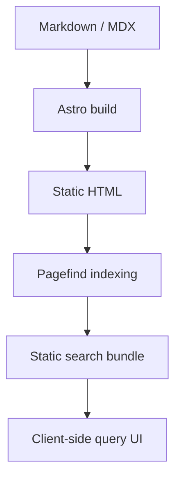

Static search is a strong fit for an academic notebook because the content changes relatively slowly, while recall quality and latency still matter.

:::note
A blog that mostly serves text does not need a large client-side framework to feel responsive.
:::

## Why static indexing works

The content model is stable:

- blog posts
- course notes
- research notes
- paper notes
- dataset notes

That structure makes it easy to generate a search index at build time and avoid a server dependency.

## Trade-offs

The main trade-off is that the search index is only refreshed when the site rebuilds. For a personal site, that is often acceptable.

## Retrieval-oriented design

Many knowledge workflows today combine writing and retrieval. Retrieval-augmented systems also demonstrate how useful pre-indexed knowledge access can be in practice [@lewis2020rag].

```ts {2,4}
export async function searchSite(query: string) {
  const pagefind = await import('/pagefind/pagefind.js');
  const response = await pagefind.search(query);
  return response.results;
}
```

## Minimal client logic

The browser only needs enough JavaScript to:

1. lazy-load the Pagefind runtime
2. issue the query
3. render the result list

That keeps the rest of the page almost entirely static.

```ts
const response = await pagefind.search('mermaid'); // [!code highlight]
console.log(response.results.length)
```

## Architecture sketch



## Conclusion

For a text-heavy site, static search is often the correct default. It keeps infrastructure simple without sacrificing usability.
